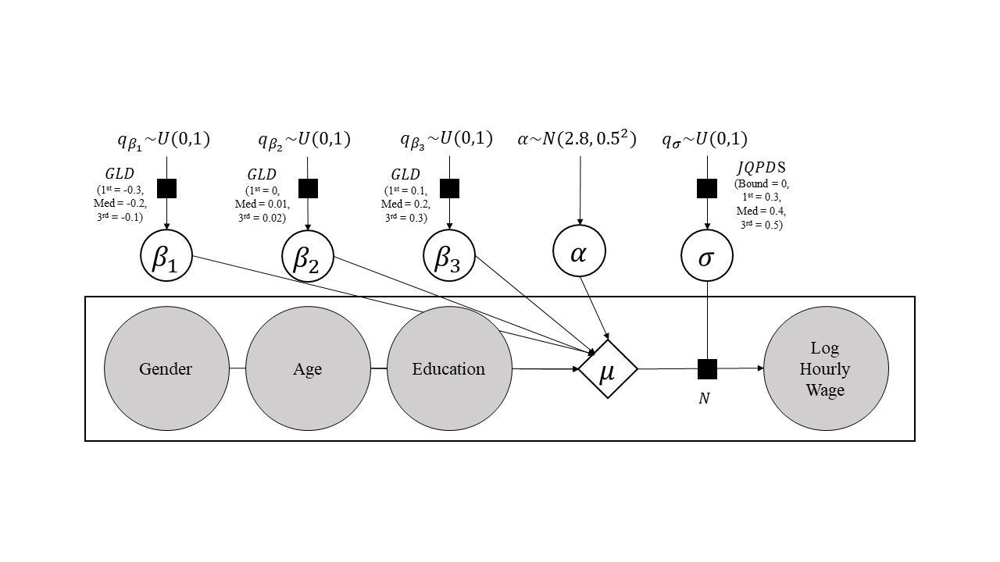

```{r, include=FALSE}
library(rstanarm)
library(ggplot2)
library(dplyr)
library(haven)
rstan::expose_stan_functions("quantile_functions.stan")
source("GLD_helpers.R")
```

```{r, include=FALSE}
library(knitr)
hook_output <- knit_hooks$get("output")
knit_hooks$set(output = function(x, options) {
  lines <- options$output.lines
  if (is.null(lines)) {
    return(hook_output(x, options))  # pass to default hook
  }
  x <- unlist(strsplit(x, "\n"))
  more <- "..."
  if (length(lines)==1) {        # first n lines
    if (length(x) > lines) {
      # truncate the output, but add ....
      x <- c(head(x, lines), more)
    }
  } else {
    x <- c(more, x[lines], more)
  }
  # paste these lines together
  x <- paste(c(x, ""), collapse = "\n")
  hook_output(x, options)
})
``` 

# Current Population Survey

## Getting CPS Data

```{r}
CPS <- as_factor(read_dta("cepr_org_1996.dta"))

CPS <- filter(CPS, month == 10)
```

## Prior predictive distribution

To have some variety in predictors, we choose one categorical (gender), one ordinal (education), and one continous (age). 

### Exploratory analysis of the variables

First, we see gender is dichotomous and age goes from 16 to 90 years old.

```{r}
table(CPS$female)
```

```{r, fig.height=3, fig.width=4}
hist(CPS$age)
```

We have to consider more carefully how to deal with education, the ordinal variable. It has five levels, as shown here:

```{r, fig.height=3, fig.width=4}
plot(CPS$educ)
```

We can treat each education level as completely different, assigning one coefficient (i.e. $\beta_{HS}$, $\beta_{SomeCollege}$, $\beta_{College}$, and $\beta_{Advanced}$) to each one -- which would be interpreted with respect to the baseline, in this case "Less than High School". This will allow that the difference between the levels of education to change (e.g. completing High School gives slightly better earnings than not completing High School, but getting some college does produce much higher earnings relative to just completing High School). However, it will make the models more complicated. In this initial approach, we will consider education as a continous variable that goes from 1 (LTHS) to 5 (Advanced). This forces the differences between the levels to be the same (e.g. the difference in earnings from getting some college relative to only high school must be the same as the difference between getting an advanced degree relative to a college degree), but simplifies the model (and thus the prior specification). Later approaches could consider education as a categorical variable.

```{r}
CPS$educ <- as.integer(factor(CPS$educ, levels = c("LTHS", "HS", "Some college", "College",
                                                   "Advanced"), ordered = TRUE))
```

Lastly, we must consider our outcome measure: hourly wage (in its raw scale and also in the log scale).

```{r, fig.height=3, fig.width=4}
hist(CPS$rw)
hist(log(CPS$rw))
```

Laslty, we will clean the dataset to remove NAs and center the predictors

```{r}
# Remove rows with NAs
CPS_clean <- filter(CPS, !is.na(rw) & !is.na(female) & !is.na(age) & !is.na(educ))

CPS_clean$age <- (CPS_clean$age - mean(CPS_clean$age))
CPS_clean$educ <- (CPS_clean$educ - mean(CPS_clean$educ))
```

### Setting up priors

We have five parameters in our model, $\alpha, \beta_{female}, \beta_{age}, \beta_{educ}, \sigma$. To build the priors we will take into account the ranges of the predictors and the distribution of the log(rw) -- which is approximatelly normally distributed and has an average of 2.8 and a SD of 0.6. This implies these are technically data-dependent priors. As a general approach, we will provide weakly informative priors that reflect a certain level of uncertainty while avoiding assigning big probabilities to the extreme and non-sensical values that flat priors or extremelly weak priors often consider.

As stated in the problem, we will use a normal distribution for the intercept. For the coefficients of gender, education, and age we will specify the prior drawing from a standard uniform distribution and transforming this from the inverse CDF of the Generalized Lambda Distribution. This will allow us to reflect our prior beliefs in the different values of the coefficients assuming they can take any value in the real line (although in reality the distribution of our beliefs could effectively bound the parameter values). The prior for sigma will be obtained using a similar procedure but transforming the variable $q \sim U(0, 1)$ with a J-QPD-S distribution -- which we will describe later.

#### $\alpha$

We used a normal prior for the intercept, which in this case will reflect the expected log(rw) of a male with average education and age. As all the predictos will be centered, the intercept is expected to be close to the mean of the distributions of log(rw) -- that is, close to 2.8. We allow some uncertainity, in this case 0.5 (i.e. meaning that we allocate very little probability to an scenario in which the intercept is less than 2.3 or more than 3.3).

```{r, fig.height=2, fig.width=3}
N_sims <- 1000

sim_alpha <- rnorm(N_sims, 2.8, 0.5)
ggplot(aes(x = x), data = data.frame(x = sim_alpha)) + 
  geom_histogram(aes(y = ..density..), bins = 10) + theme_bw() + xlab("alpha") + 
  ylab("Prior PDF")
```


#### $\beta_{Female}$

For $\beta_{Female}$, we know that, in general, women tend to earn less than men for the same amount of work. For instance, there is a famous estimate indicating that for each dollar men make women make around 0.8\$. If we wanted, we could review this literature to come up with an strong prior based on this information. Another approach is to consider that this estimate may be imprecise or maybe not applicable to the year 1996, opting for a slighlty weaker prior. We will do the latter, although expecting women to earn more or less 20\% less than men (which implies a coefficient of -0.2 in the logarithmic scale). As we are uncertain about the value of the parameter, we specify a lower quartile of -0.1 and an upper quartile of -0.3.

```{r, fig.height=2, fig.width=3, warning=FALSE}
properties_gld_beta_gender <- GLD_solver(lower_quartile = -0.3, median = -0.2, 
                                         upper_quartile = -0.1, other_quantile = -0.5, 
                                         alpha = 0.01)
gld_beta_gender <- replicate(N_sims, GLD_rng(median = -0.2, IQR = 0.3 - 0.1, 
                                             asymmetry = properties_gld_beta_gender[1], 
                                             steepness = properties_gld_beta_gender[2]))

ggplot(aes(x = x), data = data.frame(x = gld_beta_gender)) + 
  geom_histogram(aes(y = ..density..), bins = 10) + theme_bw() + 
  xlab("Beta_gender") + ylab("Prior PDF")
```

#### $\beta_{Age}$

We are not sure about the effect of age on log hourly wage, although we expect it will be positive. A reasonable estimate is that it will increase around 1% per year, but as this number could be very imprecise we will build a weak prior around this approximate increase. A GLD with a median of 0.01, a upper quartile of 0.02 and a lower quartile of 0 seems to describe a reasonable range of values. This is a weak prior in the sense that is considering the possibility that the effect of age on wages is negative or, on the contrary, 5% per year. A larger effect of age in absolute value would be unreasonable.

```{r, fig.height=2, fig.width=3, warning=FALSE}
properties_gld_beta_age <- GLD_solver(lower_quartile = 0, median = 0.01, 
                                      upper_quartile = 0.02,other_quantile = 0.05, 
                                      alpha = 0.99)
gld_beta_age <- replicate(N_sims, GLD_rng(median = 0.01, IQR = 0.02 - 0, 
                                          asymmetry = properties_gld_beta_age[1], 
                                          steepness = properties_gld_beta_age[2]))

ggplot(aes(x = x), data = data.frame(x = gld_beta_age)) + 
  geom_histogram(aes(y = ..density..), bins = 10) + theme_bw() + 
  xlab("Beta_age") + ylab("Prior PDF")
```

#### $\beta_{Educ}$

The effect of one level increase in education is arguably positive, and a reasonable number would be that it will increase earnings around 20%. As we do not have previous data on this, we will build a weak prior using GLD with median 0.2, a lower quantile of 0.1 and an upper quantile of 0.3. This is a reasonable range, and we consider it quite unlikely that the coefficient will be higher than 0.5 in the log scale.

```{r, fig.height=2, fig.width=3, warning=FALSE}
properties_gld_beta_educ <- GLD_solver(lower_quartile = 0.1, median = 0.2, 
                                       upper_quartile = 0.3,
                                       other_quantile = 0.5, alpha = 0.99)
gld_beta_educ <- replicate(N_sims, GLD_rng(median = 0.25, IQR = 0.35 - 0.15, 
                                           asymmetry = properties_gld_beta_educ[1], 
                                           steepness = properties_gld_beta_educ[2]))

ggplot(aes(x = x), data = data.frame(x = gld_beta_educ)) + 
  geom_histogram(aes(y = ..density..), bins =10) + theme_bw() + 
  xlab("Beta_educ") + ylab("Prior PDF")
```

#### $\sigma$.

We will use a $U(0,1)$ and transform it using a J-QPD-S distribution (the semi-bound is because $\sigma>0$). We saw that log(rw) is close to  to normally distributed with an average of 2.9 and a SD of 0.6. A regression with only the intercept as a predictor will therefore have a $\sigma = 0.6$. Therefore, with the three pre-defined predictors we expect $\sigma$ to be higher than 0 and to be less than 0.6. However, among these possible values it would be surprising that $sigma$ was very low (e.g. 0.2), as that would imply age, education, and gender almost explained most of the variance in log hourly wages -- something not reasonable given this is not accounting for the type of industry, for instance. Similarly, a sigma of 0.6 would be surpising, as we expect these variables to have some degree of predictive value over earnings.

Thus, we will use a J-QPD-S distribution specifying a lower quantile of 0.3, an upper quantile of 0.5, and a median of 0.4.

```{r, fig.height=2, fig.width=3, warning=FALSE}
properties_jqpds_sigma <- c(lower = 0.3, median = 0.4, upper = 0.5)
jqpds_sigma <- replicate(N_sims, JQPDS_rng(lower_bound = 0, alpha = 0.1, 
                                           quantiles = properties_jqpds_sigma))

ggplot(aes(x = x), data = data.frame(x = jqpds_sigma)) + 
  geom_histogram(aes(y = ..density..), bins = 20) + theme_bw() + 
  xlab("Sigma") + ylab("Prior PDF")
```

### Diagram

```{r pressure, echo=FALSE, fig.cap="Diagram", out.width = '80%'}

```

## Drawing from the Prior Predictive Distribution

We obtain a reasonable prior distribution for $R^2$ with a median close to 0.5 but that is wide enough to allow for a higher or lower value.

```{r, fig.height=2, fig.width=3}
N <- nrow(CPS_clean)
intercept <- t(replicate(N, sim_alpha))

mu = intercept + CPS_clean$female %*% t(gld_beta_gender) + 
  CPS_clean$educ %*% t(gld_beta_educ) + CPS_clean$age %*% t(gld_beta_age)

sigmas = jqpds_sigma^2

# This code can be vectorized
r2 <- rep(NA, N_sims)
sumreses <- rep(NA, N_sims)
for(i in 1:N_sims){
  sumres <- var(mu[,i])
  r2_s <- sumres/(sumres + sigmas[i])
  sumreses[i] <- sumres
  r2[i] <- r2_s
}

ggplot(aes(x = x), data = data.frame(x = r2)) + 
  geom_histogram(aes(y = ..density..), bins = 20) + theme_bw() + 
  xlab("R2") + ylab("Prior PDF")
```

## Interpreting the Posterior Coefficients

```{r}
fit <- stan_lm(log(rw) ~ female + age + educ, data = CPS_clean, 
               prior = R2(location = median(r2), what = "median"), 
               prior_intercept = normal(location = 2.8, scale = 0.5, autoscale = FALSE),
               cores = 0, chains = 4, refresh = 0)

print(fit, digits = 3)
```

With the model we can calculate in how many of the 4000 draws from the posterior are the coefficients positive: 

```{r}
fit_mat <- as.matrix(fit)

print(paste0("Intercept: ", sum(fit_mat[, 1]>0)/4000))
print(paste0("Beta_female: ", sum(fit_mat[, 2]>0)/4000))
print(paste0("Beta_age: ", sum(fit_mat[, 3]>0)/4000))
print(paste0("Beta_educ: ", sum(fit_mat[, 4]>0)/4000))
```

That is, all the draws for the $\alpha$, $\beta_{age}$, and $\beta_{educ}$ are positive while all the draws for $\beta_{female}$ are negative. This small variation, which is due to the large sample size (1278), can be better displayed with a histogram of the posterior distribution for these parameters: 

```{r}
fit_mat_plot <- reshape2::melt(fit_mat[,1:5])

ggplot(aes(x = value), data = fit_mat_plot) + 
  facet_wrap(~parameters, scales = "free_x") +
  geom_histogram() + theme_bw() + xlab("Posterior")
```

As an experiment, we fitted the same regression with flat priors. We obtained extremelly similar results, something which is not surprising given the fact that our priors were relativelly weak to start with and that the sample size is quite large. However, this is not recommended as we usually have some initial range of reasonable values. Additionally, even weak priors could help to estabilize the coefficients in more complex settings.

```{r}
fit <- stan_lm(log(rw) ~ female + age + educ, data = CPS_clean, prior = NULL, 
               prior_intercept = NULL, cores = 0, chains = 4, , refresh = 0)

print(fit, digits = 3)
```

# Stock Car Racing

## Inverse CDF

The function for drawing from the inverse CDF, which we will call $G(q, \mu)$, is the following:

```{r}
qdist <- function(q, mu){
  y <- mu + log(-log(q))
  return(y)
}
```

Note that it is vectorized. For instance, we can do:

```{r}
qdist(runif(5, 0, 1), mu = 2)
```

## Prior Predictive Distribution

```{r}
nascar <- read.table("http://ww2.amstat.org/publications/jse/datasets/nascard.dat.txt",
                     stringsAsFactors = FALSE)
colnames(nascar) <- c("RaceID", "Year", "RaceOfYear",
                      "Finish", "Start", "Laps", "PrizeMoneyWon",
                      "Cars", "Make", "Driver")
nascar$Winner <- nascar$Finish == 1

nascar <- nascar %>% filter(Year==1999)
```

```{r}
# Subset first race
nascar_first <- nascar %>% filter(RaceOfYear == 1) 
```

We have a model such as:

$$\text{Time} \sim G(q, \mu)$$
where:

$$\mu = \alpha + \beta_{Start} \text{Start} + \sum_j^J \beta_{j} \text{Driver}_j$$
$$q \sim U(0, 1)$$
We have to define the priors for the parameters $\alpha$, $\beta_{Start}$, and all the $\beta_j$ corresponding to $J$ drivers. Cars take, on average, 210 minutes to finish the race. Based on this, we defined:

$$\alpha \sim N(190, 20^2)$$
$$\beta_{start} \sim N(1, 1^2)$$
$$\beta_j \sim N(0, 5^2) \text{ for all } j$$

The intercept does not have a clear interpretation as it corresponds to the $\mu$ for a driver with a starting position of zero. However its mean and SD are reasonable given that each driver takes on average around 210 minutes to finish the race while also assuming some variation that represents our uncertainty about this estimate.

The $\beta_{start}$ reflects the increased extra race time, on average, for a driver who starts one additional position away from the leading position. We decided for an obviously positive but relatively small value given that the race is quite long and that the advantage of starting first should decrease over time.

The $\beta_{j}$ refers to the coefficient for each driver $j$, and corresponds to the extra time it takes for each driver to complete the race. We expect good drivers to have negative coefficients and bad drivers to have positive coefficients. As we don't know which drivers are good and which drivers are bad, we centered the prior at 0. 

```{r}

set.seed(2134)
N_sims <- 10000

drivers <- nascar_first$Driver
N_drivers <- length(drivers)

# Note that the first element of nascar_first$Start 
# corresponds to the driver who started first in this dataset
start_race = nascar_first$Start

time <- matrix(rep(NA, N_sims), nrow = N_drivers, ncol = N_sims)

# Prior dist for alpha
alpha <- rnorm(N_sims, 190, 20)

# Prior dist for Beta_start
beta_start <- rnorm(N_sims, 1, 1)

# Prior dist for the drivers in a matrix
beta_drivers <- t(replicate(N_drivers, rnorm(N_sims, 0, 5)))

for(i in 1:N_drivers){
  mu <- alpha + beta_start*start_race[i] + beta_drivers[i,]
  time_driver <- sapply(mu, qdist, q = runif(1))
  time[i,] <- time_driver
}

```

```{r}
did_first_won <- rep(NA, N_sims)

for(i in 1:N_sims){
  did_first_won[i] <- as.integer(time[1, i] == min(time[, i]))
}

sum(did_first_won)/N_sims
```

Under these priors, the probability that the driver who starts first in the race wins is around 0.25.

## Posterior distribution

```{r, warning = FALSE}
set.seed(12345)

N_drivers = length(unique(nascar$Driver))

my_prior <- normal(location = c(-1, rep(0, N_drivers)), 
                   scale = c(1, rep(5, N_drivers)), autoscale = FALSE)

fit <- stan_clogit(Winner ~ Start + Driver - 1, data = nascar, 
                   strata = RaceID, chains = 4, cores = 4,
                   prior = my_prior, refresh = 0)
```

The results are the following (only showing the coefficients for the first three drivers):

```{r, output.lines=10}
print(fit, digits = 3)
```

## Which Driver is Best?

```{r}
posterior_mat <- as.matrix(fit)[,2:70]

champs <- sort(table(apply(posterior_mat, FUN = which.max, MARGIN = 1)), 
               decreasing = TRUE)

names <- rep(NA, length(champs))
prob <- rep(NA, length(champs))

for(i in 1:length(champs)){
  names[i] <- colnames(posterior_mat)[as.integer(names(champs[i]))]
  prob[i] <- unname(champs[i]/4000)
}

champs_df <- data.frame(names = names, prob = prob)

```

We can organize in a table the probability that each of the drivers is the best on the given year.

```{r}
champs_df[1:5,]
```

We see that Jeff Burton has a 24% probability of being the best driver of the year (i.e. in 24% of the draws from the posterior distribution his 'skill' coefficient is the highest). 

```{r}

```

